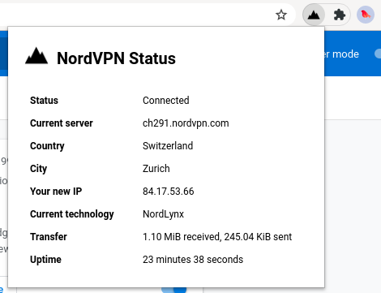

# Chrome extension monitoring the status of the NordVPN connection on Linux

This extension shows the status of NordVPN on Linux systems, simply by parsing the output of `nordvpn status` of the [NordVPN command line tool](https://nordvpn.com/download/linux/).

